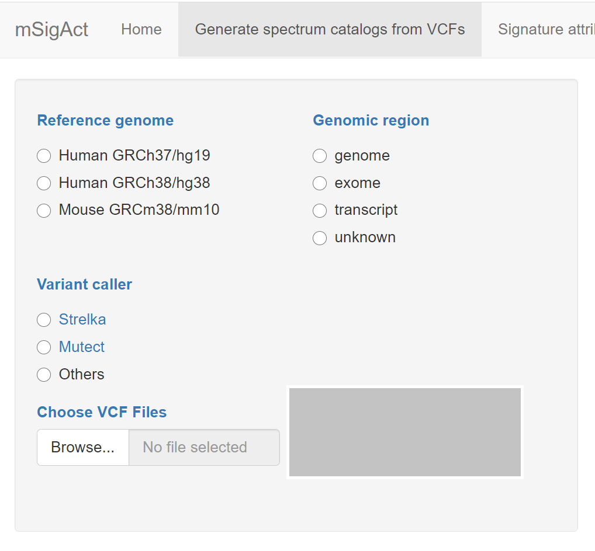

Introduction
------------

The function of the tab “Generate spectrum catalogs from VCFs” is, well,
to generate spectrum catalogs from VCFs and also to plot the spectra.

The main input area is this

It is necessary to select one item from each input radio button, and
then select one or more VCF Files (variant call files) for upload.
