Table of contents
=================

-   [Introduction](#introduction)
-   [Input](#input)
-   [Test and example data](#testAndExample)
-   [Select the reference genome](#selectRefGenome)
-   [Select the genomic region](#selectRegion)
-   [Select the variant caller](#selectVariantCaller)
-   [Optionally rename the samples](#renameSamples)
-   [Select and upload one or more VCFs](#uploadVCFs)
-   [Create the spectra catalogs](#createCatalogs)
-   [Examine the spectra](#examineSpectra)
-   [Signature attribution](#sigAttribution)

Guide to generating spectrum catalogs and plots from VCFs in the <a href="https://msigact.ai" target="_blank">mSigAct web server</a>
------------------------------------------------------------------------------------------------------------------------------------

###  Introduction

The function of the tab “Generate spectrum catalogs from VCFs” is, to
generate spectrum catalogs from VCFs and also to plot the spectra.

###  The input area for uploading VCFs

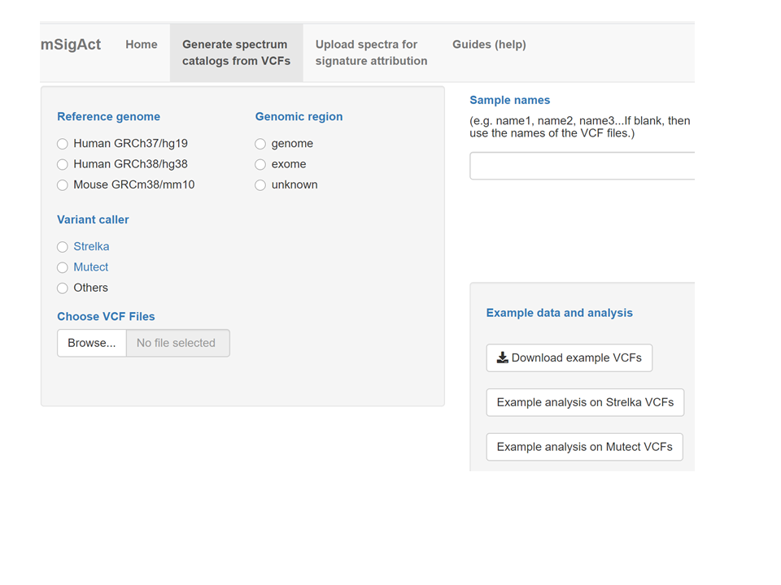

###  Test and example data

These buttons provide some pre-loaded example data and several test VCFs
that you can download and then re-upload.

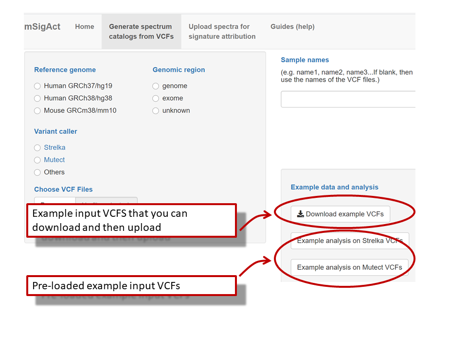

###  Select the reference genome

###  Select the genomic region

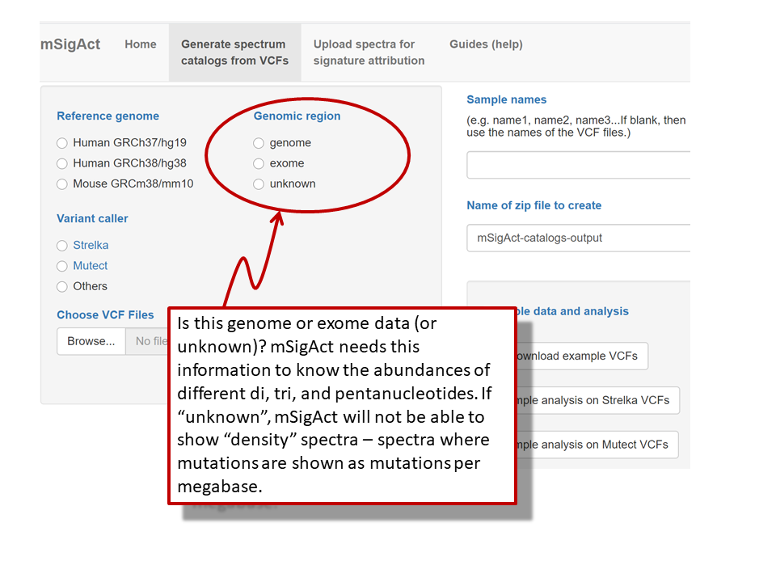

###  Select the variant caller

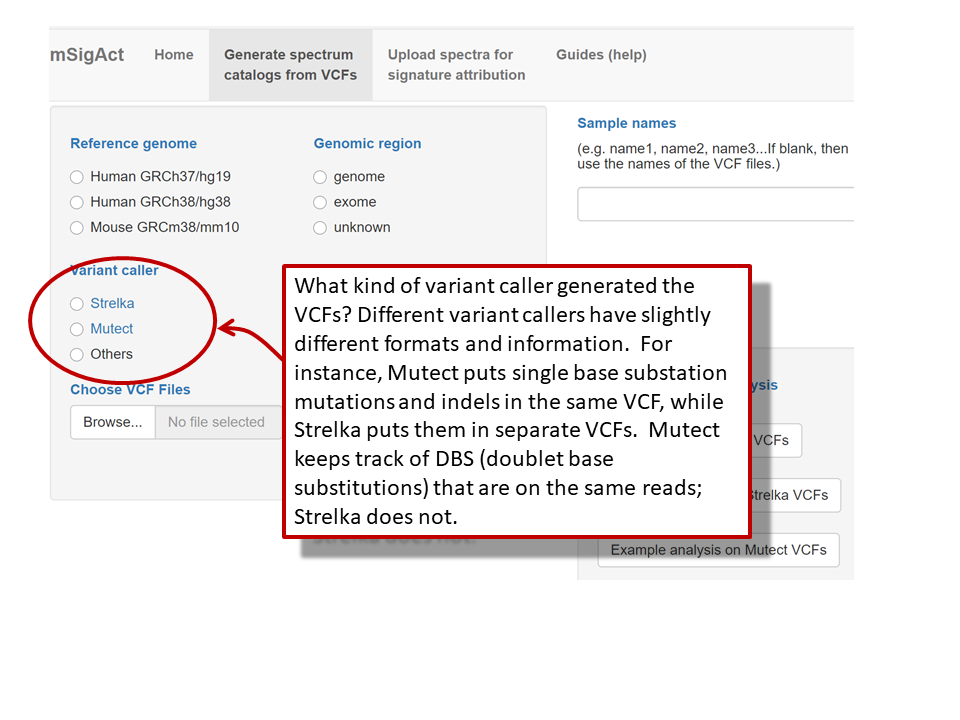

###  Optionally rename the samples

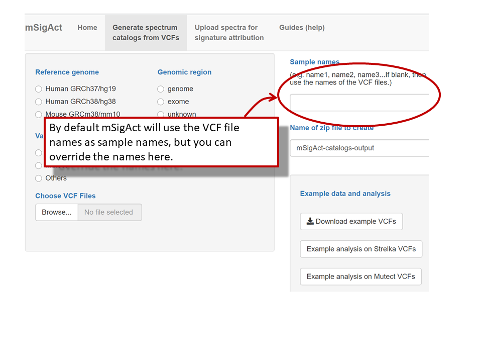

###  Select and upload one or more VCFs

VCF formats are only partly standardized; please contact us if mSigAct
has difficulty analyzing your VCF.

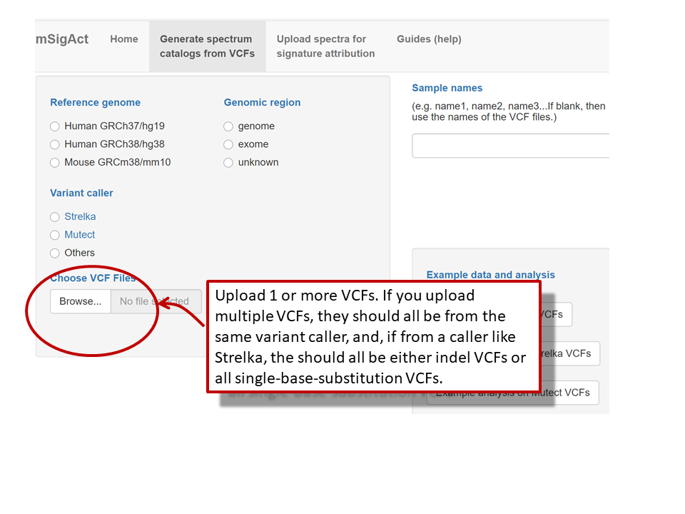

###  After the upload is complete, create the spectra catalogs

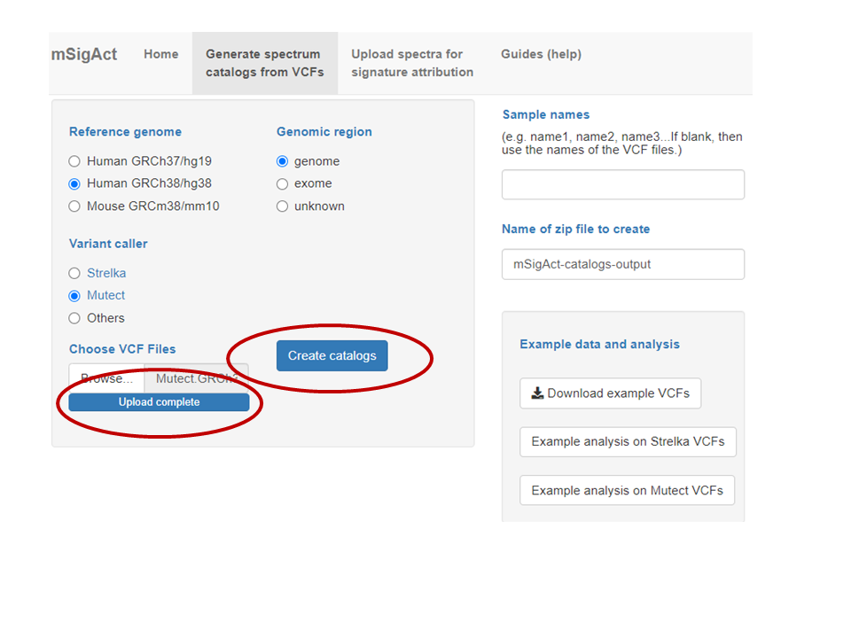

###  Once the catalogs are created, optionally examine the spectra

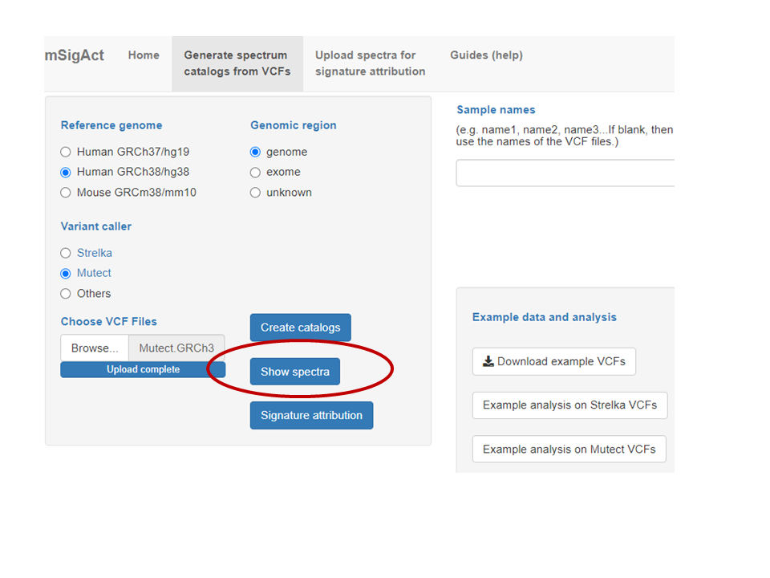

### SBS96 and SBS192 spectra

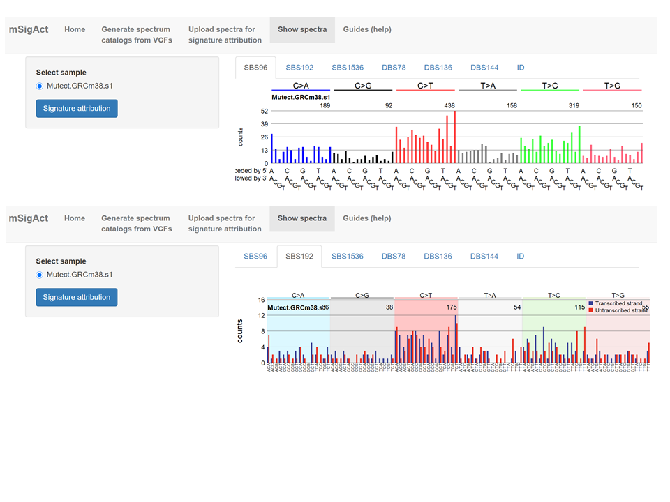

### SBS1536 and DBS79 spectra

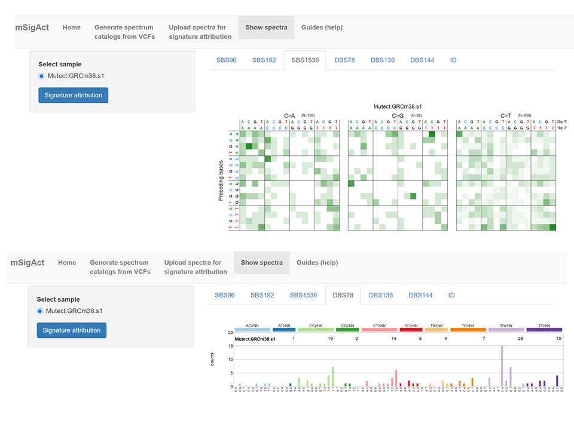

### DBS136 spectrum

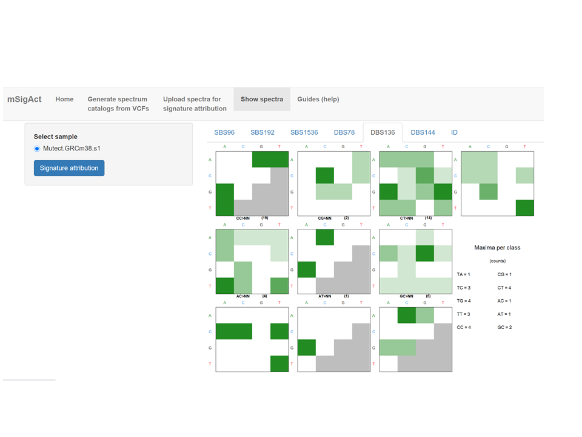

### Simplified DBS144 spectrum and indel spectrum

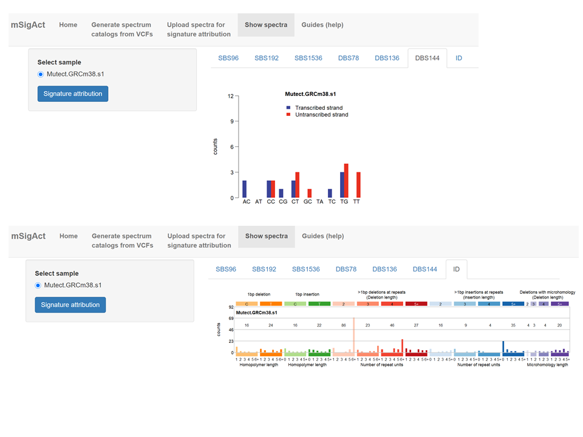

###  You can go to signature attribution any time after the catalogs are created

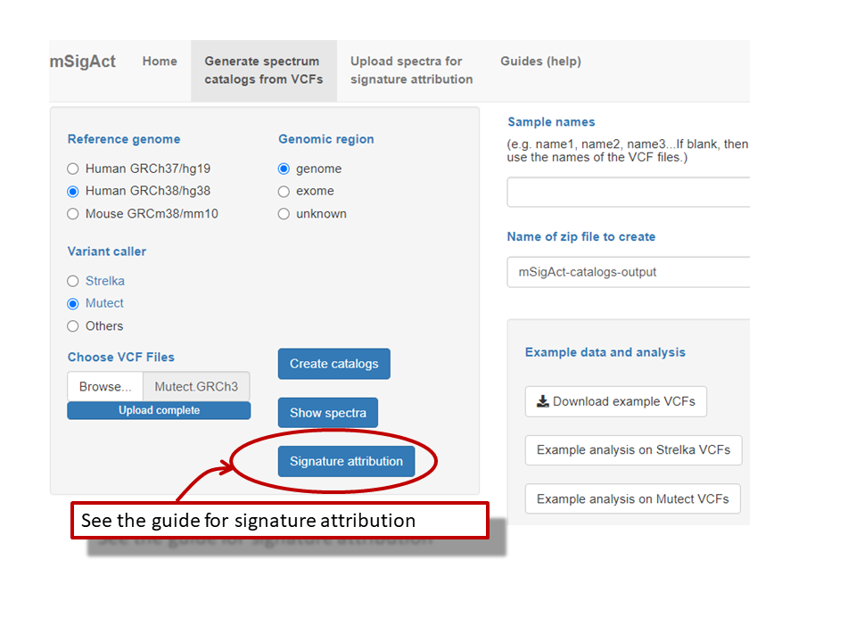
