Guide to signature attribution in the [mSigAct web server](https://msigact.ai)
------------------------------------------------------------------------------

The tab “Signature attribution” provides analytical tools to estimate
which mutational signatures have contributed to the mutational spectrum
of a single tumor or tissue sample.

### The input area for uploading spectra catalogs

You can also analyze spectra catalogs generated from VCFs in the mSigAct
web server.

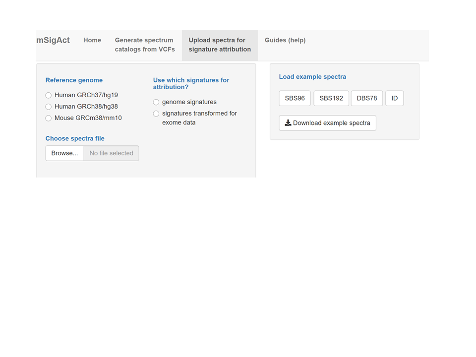

### Pre-loaded example spectra and example spectra catalogs to download then update

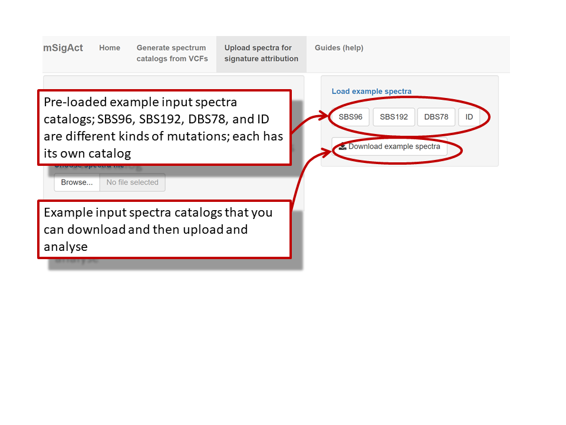

### Important: genome or exome data?

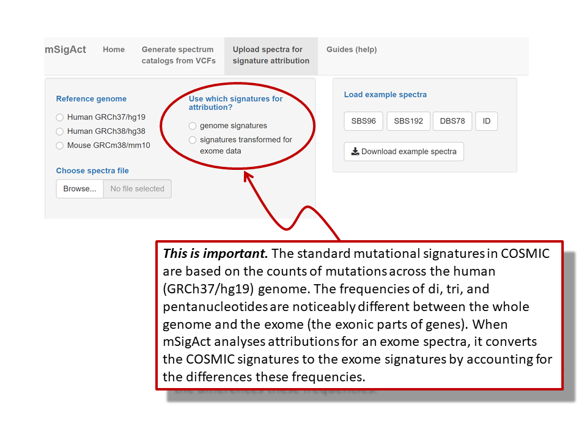

### What reference genome to use?

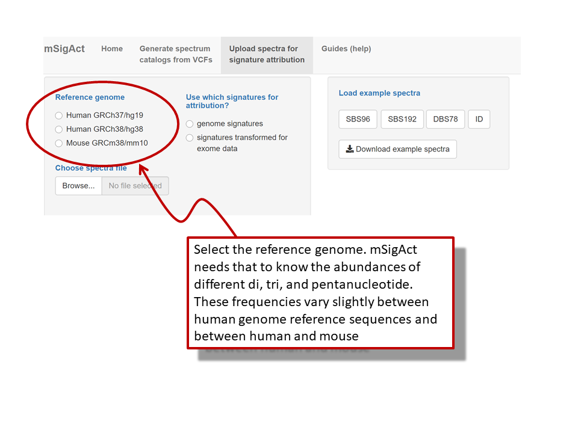

### Upload the spectra from a .csv file

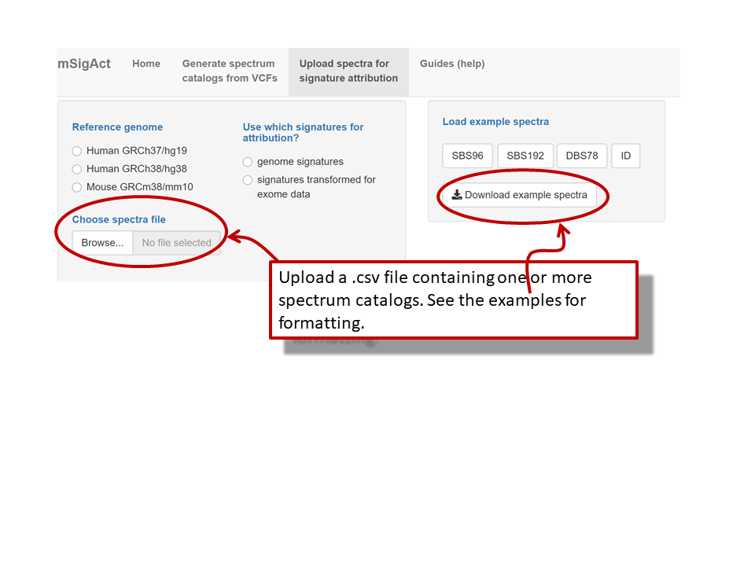

### You can show the spectra or start the attribution analysis

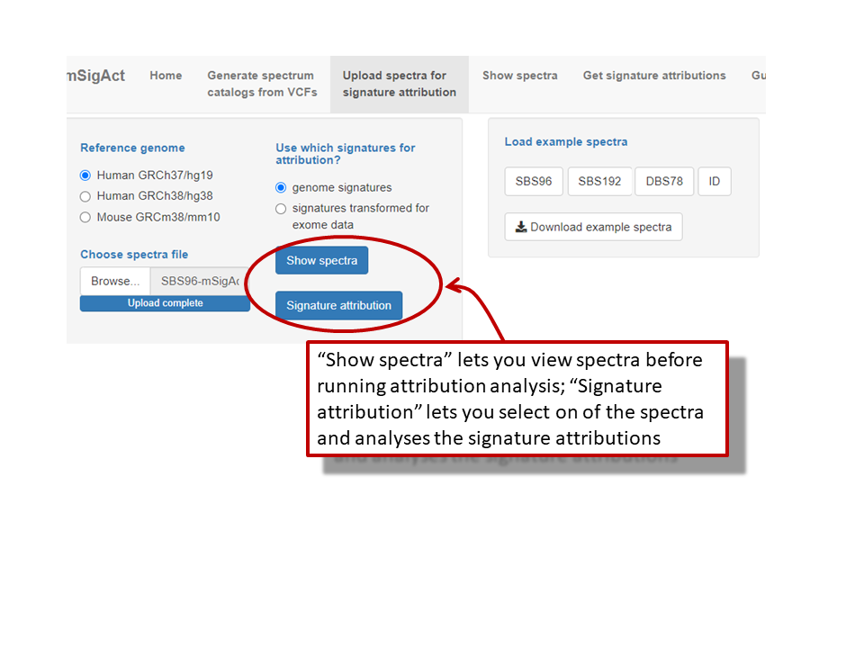

### mSigAct needs to know the cancer type to decide what signatures to consider

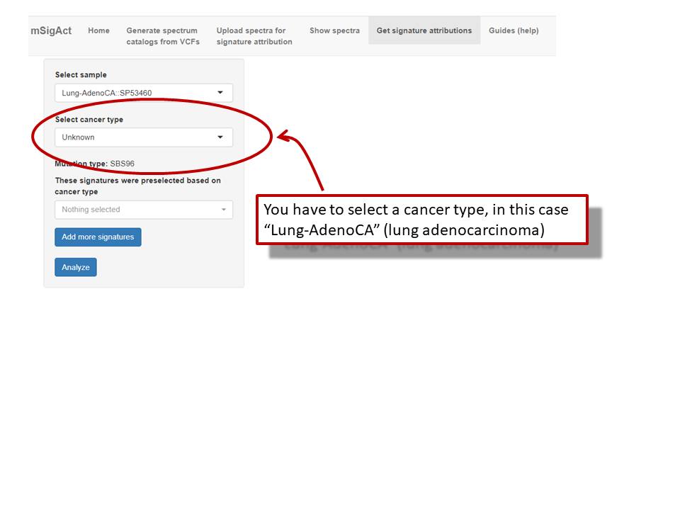

### Add or delete signatures from the analysis?

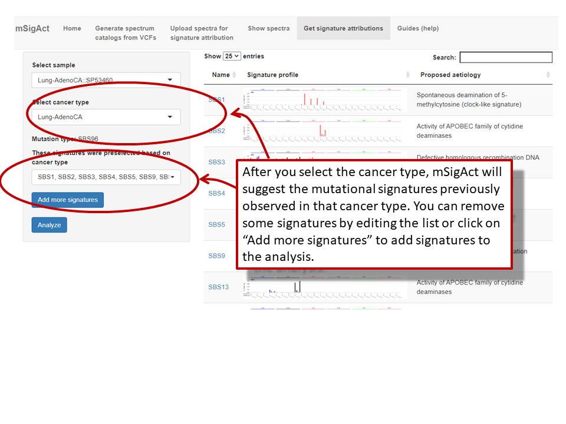

### Look at the mutational signatures under consideration

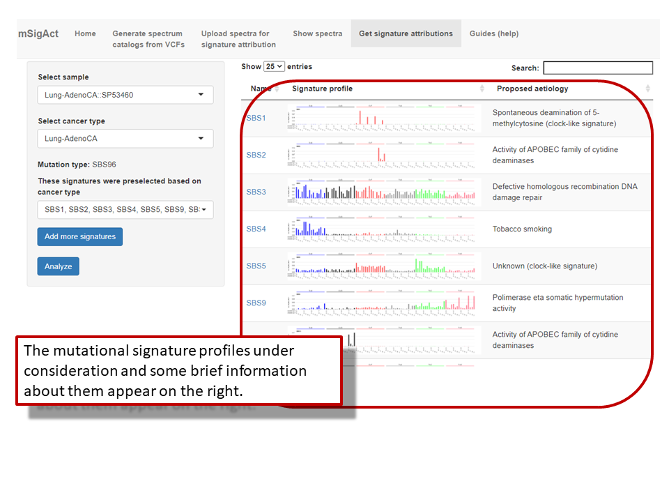

### Start the analysis

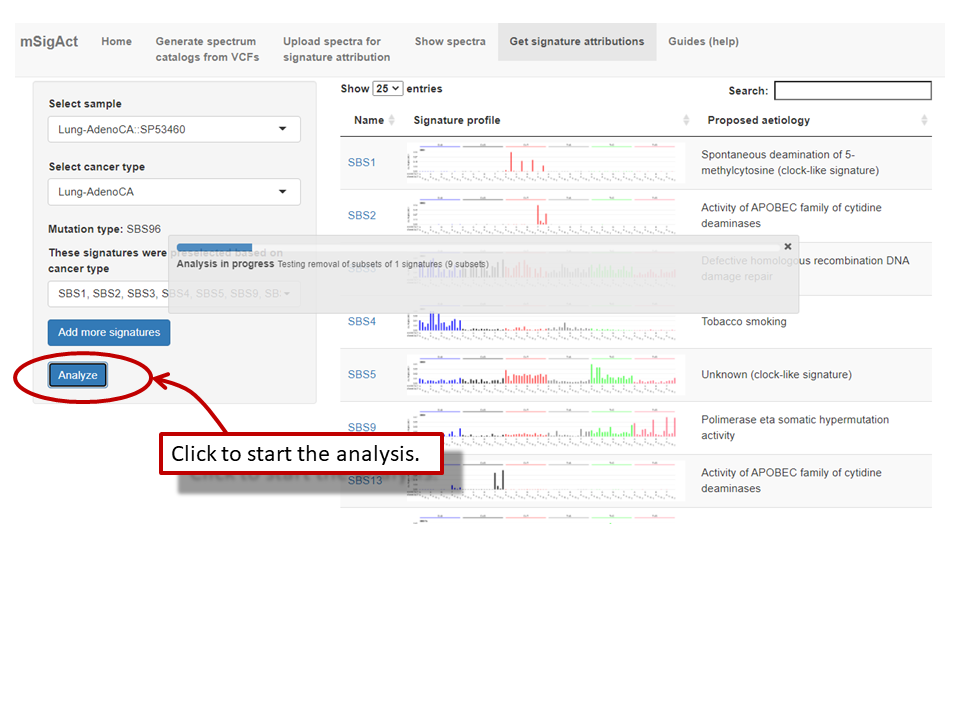

### Examine the analysis results

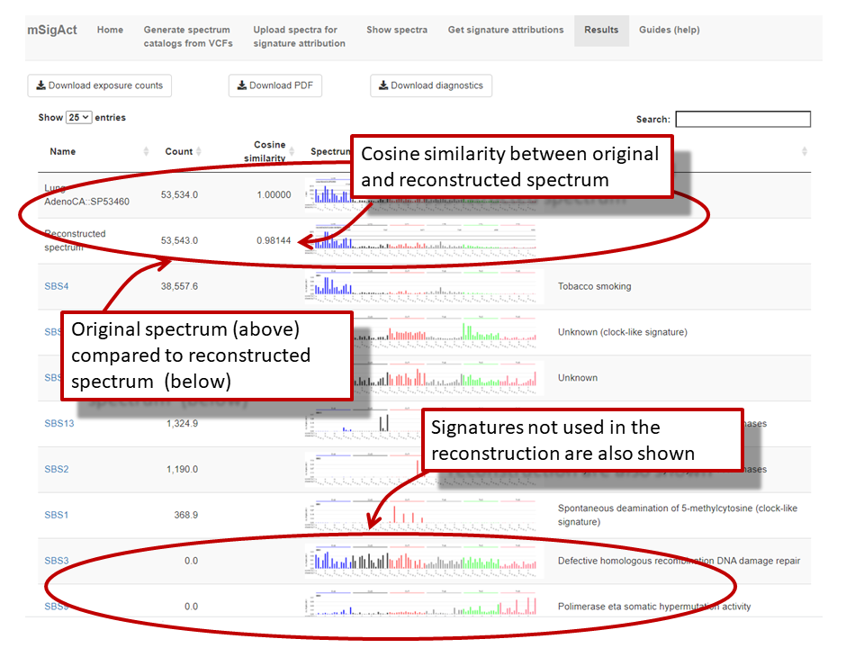

### Attribution for other mutation types is similar

Here is an analysis of insertion and deletion signature attribution.

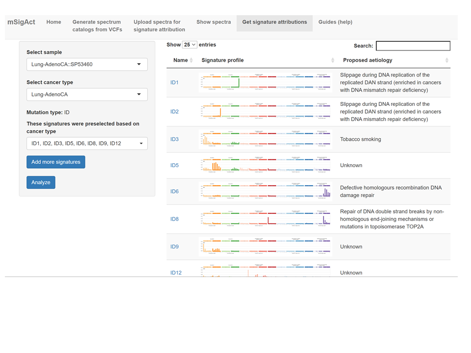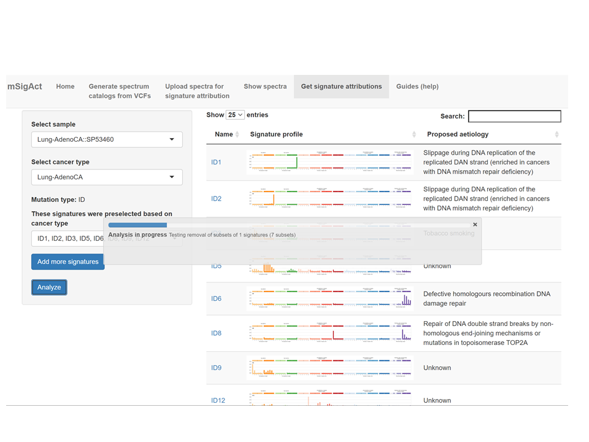
