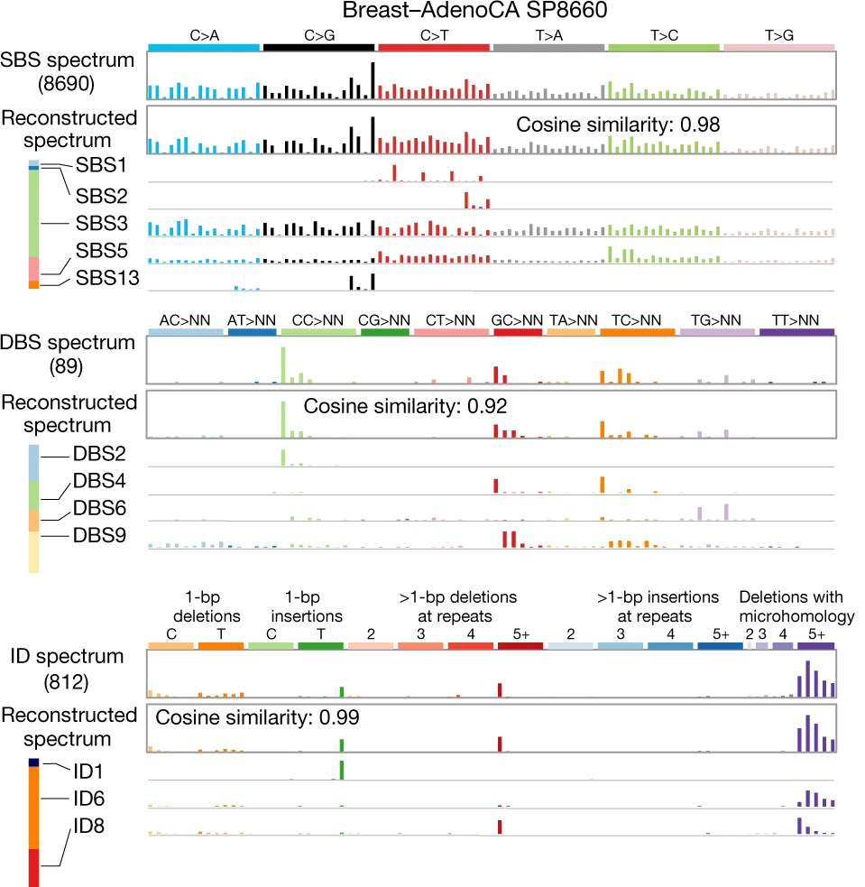
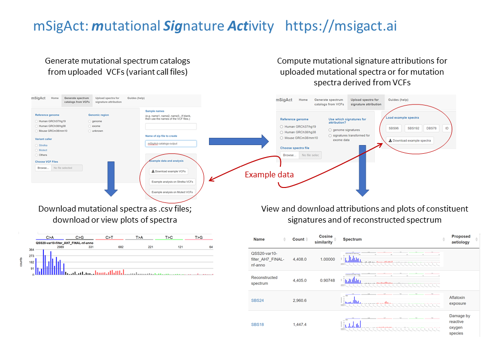

```{r setup, include=FALSE}
knitr::opts_chunk$set(echo = TRUE)
```

# Table of contents

  * [Introduction](#indtroduction)
  * [Mutational signature examples](#examples)
  * [Background](#background)
  * [Workflow](#workflow)
  * [Creating mutational spectrum catalogs](#createCatalogs)
  * [Estimating mutational signature activities](#sigAttribution)
  * [Browser compatibility](#browserCompatibility)
  * [Code availability](#codeAvailability)
  * [Getting help](#gettingHelp)

<hr />

## <a id="introduction"></a> Introduction to the [mSigAct web server](https://msigact.ai){target="_blank"}

The [mSigAct web server](https://msigact.ai){target="_blank"} provides methods for analyzing mutational 
signatures. "mSigAct" is an abbreviation of 
<big><strong>m</strong></big>utational 
<big><strong>Sig</strong></big>nature <big><strong>Act</strong></big>ivity. 
A mutational signature is the pattern of mutations generated 
by a particular 
mutational process. (At least, this is the ideal that we usually aim for.)

<hr />

## <a id="examples"></a> Mutational signature examples

### Example single base substitution signature: mutations from CG to TG

```{r SBS1, echo=FALSE, fig.height=2.5, fig.width=9 }
par(mar=c(6,6,4,1))
par(cex = 0.8)
ICAMS::PlotCatalog(PCAWG7::signature$genome$SBS96[ , "SBS1", drop = FALSE])
```

These are "single base substitutions" (SBSs)
caused by deamination of 5-methyl cytosine.
We most often look at
SBS mutations in the context of preceding and following bases. 
Also, by convention,
we usually look a mutations from C or T to another
base. We reverse complement mutations from G or A to another base.
In the figure above we see mutational signature "SBS1", which
is the signature of 5-methyl cytosine deamination. It consists 
almost entirely of mutations from ACG to ATG, CCG to CTG, GCG to GTG
and TCG to TTG. Signatures based on SBS mutations in the 
context of the preceding and following bases are called "SBS96 signatures".
A compendium with standard nomenclature is at the 
[COSMIC Single Base Substitution web site](https://cancer.sanger.ac.uk/cosmic/signatures/SBS/index.tt){target="_blank"}.

We can also look at single base substitutions in the context of the
preceding and following 2 bases, giving us "SBS1536
signatures". We also sometimes look at signatures of
single base substitution mutations
in transcripts by distinguishing their transcribed (antisense)
and untranscrbed (sense) strand, giving us "SBS192 
signatures." 

<hr />

### Example insertion and deletion signature: moderately-sized deletions with microhomology

```{r ID6, echo=FALSE, fig.height=2.5, fig.width=9 }
par(mar=c(5,6,4,1))
par(cex = 0.8)
ICAMS::PlotCatalog(PCAWG7::signature$genome$ID[ , "ID6", drop = FALSE])
```

These are common in tumors with defective 
homologous-recombination-based DNA-damage repair, often 
BRCA1 or BRCA2-deficient tumors.
The classification for insertions and deletions is
detailed at 
[https://www.synapse.org/#!Synapse:syn11801742](https://www.synapse.org/#!Synapse:syn11801742){target="_blank"}.

<hr />

### Example doublet base substitution signature: CC to TT mutations

```{r DBS1, echo=FALSE, fig.height=2.5, fig.width=9 }
par(mar=c(5,6,4,1))
par(cex = 0.9)
ICAMS::PlotCatalog(PCAWG7::signature$genome$DBS78[ , "DBS1", drop = FALSE])
```

These are a kind of 
of "doublet base substitution", (DBS)
mutations that stem from ultraviolet-radiation-induced pyrimidine dimers.
The classification of
DBSs is detailed at
[https://www.synapse.org/#!Synapse:syn11801895](https://www.synapse.org/#!Synapse:syn11801895){target="_blank"}

<hr />

## <a id="background"></a> A mutational spectrum is usually an overlay of multple mutational signatures

A single tumor or tissue sample usually contains mutations from
multiple mutational processes, each of which generates mutations that
when combined constitute the mutational spectrum of the sample,
as shown in this figure:

```{r mutograph, echo=FALSE, out.width="60%"}

```

Reproduced from 
[Alexandrov et al., 2020](https://www.nature.com/articles/s41586-020-1943-3){target="_blank"},
under the
[Creative Commons Attribution 4.0 International License](https://creativecommons.org/licenses/by/4.0/){target="_blank"}.

This breast cancer has an SBS96 spectrum that is
an overlay of signatures SBS1, SBS2, SBS3, SBS5, and SBS13,
with SBS3 (the SBS signature of defective homologous-recombination-based
DNA repair) contributing the the bulk of the mutations.
The breast cancer's DBS spectrum has signatures 
DBS2, DBS4, DBS6, and DBS9. Its insertion and
deletion (indel) spectrum has indel signatures ID1, ID6, and
ID8. The latter two indel signatures are characteristic of tumors with 
defective homologous-recombination-based
DNA repair, which is consistent with the large number of
mutations due to SBS3.

For more extensive background, please see 
[Alexandrov et al., 2020](https://www.nature.com/articles/s41586-020-1943-3){target="_blank"}.

The a list and plots of the the currently known mutational signatures, please
see
[https://cancer.sanger.ac.uk/cosmic/signatures/index.tt](https://cancer.sanger.ac.uk/cosmic/signatures/index.tt){target="_blank"}.

<hr />

## <a id="workflow"></a> Overall workflow

```{r worflow_overview, echo=FALSE, out.width="100%"}

```

<hr />

## <a id="createCatalogs"></a> Using the [mSigAct web server](https://msigact.ai){target="_blank"} to create mutational spectrum catalogs from variant call files and plot them

Please see the "Generate spectrum catalogs from VCFs"
tab for more information and examples.
The [mSigAct web server](https://msigact.ai){target="_blank"} can generate and 
plot mutational spectra from VCF files generated by
the [Strelka](https://github.com/Illumina/strelka){target="_blank"} or
[Mutect](https://github.com/broadgsa/gatk){target="_blank"} variant callers.

<hr />

## <a id="sigAttribution"></a> Using the [mSigAct web server](https://msigact.ai){target="_blank"} to estimate mutational signature activities

By "mutational signature activities"
we refer to the numbers of mutations generated by each
mutational signature (or more precisely, generated by each
mutational process). For the breast cancer example above, this
would involve estimating which mutational signatures (processes)
generated the somatic mutations and how many mutations
each signature generated. This is in fact a challenging 
problem, and the purpose of this
functionality in the [mSigAct web server](https://msigact.ai){target="_blank"}
is to allow you to consider and examine all the evidence in this
analysis. Please see the "Signature attribution" tab for 
more information and examples.

<hr />

## <a id="browserCompatibility"></a> [mSigAct web server](https://msigact.ai){target="_blank"} browser compatibility

The [mSigAct web server](https://msigact.ai){target="_blank"} 
has been tested under the following browsers and operating systems

```{r echo = FALSE, results = "asis"}
df <- data.frame(OS = c("Linux", "MacOS", "Windows"),
                 Version = c("&nbsp;&nbsp;Ubuntu 20.04&nbsp;&nbsp;", "Mojave", "10"),
                 Chrome = c("&nbsp;&nbsp;&nbsp;86.0.4240.198&nbsp;&nbsp;&nbsp;",
                            "87.0.4280.88", "87.0.4280.88"),
                 Edge = c("N/A", "87.0.664.60", "87.0.664.60"),
                 Firefox = c("&nbsp;&nbsp;&nbsp;&nbsp;82.0.3&nbsp;&nbsp;&nbsp;&nbsp;", 
                             "84.0", "83.0"),
                 Safari = c("N/A", "14.0", "N/A"))
knitr::kable(df, format = "simple", padding = 4, align = "c", escape = FALSE)
```

<hr />

## <a id="codeAvailability"></a> Code availability

The [mSigAct web server](https://msigact.ai){target="_blank"} code is available at 
github at 
[https://github.com/steverozen/mSigAct.server](https://github.com/steverozen/mSigAct.server){target="_blank"}
and is released under 
the GPL3
open source license. 
Other code used by the web
server includes [mSigAct](https://github.com/steverozen/mSigAct){target="_blank"}, 
[ICAMS](https://cran.r-project.org/package=ICAMS){target="_blank"}, 
[ICAMSxtra](https://github.com/steverozen/ICAMSxtra){target="_blank"}, and 
[PCAWG7](https://github.com/steverozen/PCAWG7){target="_blank"}, all released
under the GPL3 open source license.

<hr />

## <a id="gettingHelp"></a>Getting help

To report issues, make suggestions, and request help post on
[the mSigAct webserver GitHub site](https://github.com/steverozen/mSigAct.server/issues){target="_blank"}
or contact [steverozen@gmail.com](mailto:steverozen@gmail.com){target="_blank"}.