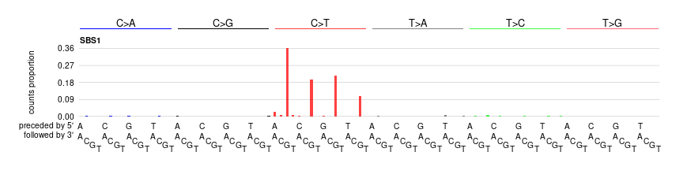
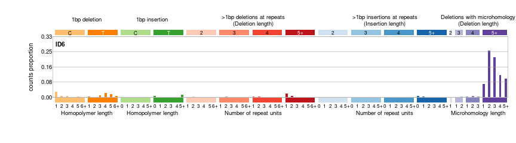
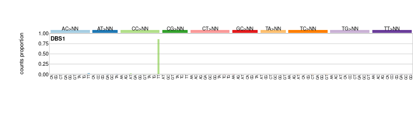

Introduction
------------

The <a href="https://msigact.ai" target="_blank">mSigAct web server</a>
provides methods for analyzing mutational signatures. “mSigAct” is an
abbreviation of <big><strong>m</strong></big>utational
<big><strong>Sig</strong></big>nature
<big><strong>Act</strong></big>ivity. A mutational signature is the
pattern of mutations generated by a particular mutational process. (At
least, this is the ideal that we usually aim for.)

### Mutational signature examples

#### Example single base substitution signature: mutations from CG to TG

These are “single base substitutions” (SBSs) caused by deamination of
5-methyl cytosine. We most often look at SBS mutations in the context of
preceding and following bases. Also, by convention, we usually look a
mutations from C or T to another base. We reverse complement mutations
from G or A to another base. In the figure above we see mutational
signature “SBS1”, which is the signature of 5-methyl cytosine
deamination. It consists almost entirely of mutations from ACG to ATG,
CCG to CTG, GCG to GTG and TCG to TTG. Signatures based on SBS mutations
in the context of the preceding and following bases are called “SBS96
signatures”. A compendium with standard nomenclature is at the
<a href="https://cancer.sanger.ac.uk/cosmic/signatures/SBS/index.tt" target="_blank">COSMIC Single Base Substitution web site</a>.

We can also look at single base substitutions in the context of the
preceding and following 2 bases, giving us “SBS1536 signatures”. We also
sometimes look at signatures of single base substitution mutations in
transcripts by distinguishing their transcribed (antisense) and
untranscrbed (sense) strand, giving us “SBS192 signatures.”

#### Example insertion and deletion signature: moderately-sized deletions with microhomology

These are common in tumors with defective homologous-recombination-based
DNA-damage repair, often BRCA1 or BRCA2-deficient tumors. The
classification for insertions and deletions is detailed at
<a href="https://www.synapse.org/#!Synapse:syn11801742" target="_blank">https://www.synapse.org/#!Synapse:syn11801742</a>.

#### Example doublet base substitution signature: CC to TT mutations

These are a kind of of “doublet base substitution”, (DBS) mutations that
stem from ultraviolet-radiation-induced pyrimidine dimers. The
classification of DBSs is detailed at
<a href="https://www.synapse.org/#!Synapse:syn11801895" target="_blank">https://www.synapse.org/#!Synapse:syn11801895</a>

### A mutational spectrum is usually an overlay of multple mutational signatures

A single tumor or tissue sample usually contains mutations from multiple
mutational processes, each of which generates mutations that when
combined constitute the mutational spectrum of the sample, as shown in
this figure:

Reproduced from
<a href="https://www.nature.com/articles/s41586-020-1943-3" target="_blank">Alexandrov et al., 2020</a>,
under the
<a href="https://creativecommons.org/licenses/by/4.0/" target="_blank">Creative Commons Attribution 4.0 International License</a>.

This breast cancer has an SBS96 spectrum that is an overlay of
signatures SBS1, SBS2, SBS3, SBS5, and SBS13, with SBS3 (the SBS
signature of defective homologous-recombination-based DNA repair)
contributing the the bulk of the mutations. The breast cancer’s DBS
spectrum has signatures DBS2, DBS4, DBS6, and DBS9. Its insertion and
deletion (indel) spectrum has indel signatures ID1, ID6, and ID8. The
latter two indel signatures are characteristic of tumors with defective
homologous-recombination-based DNA repair, which is consistent with the
large number of mutations due to SBS3.

For more extensive background, please see
<a href="https://www.nature.com/articles/s41586-020-1943-3" target="_blank">Alexandrov et al., 2020</a>.

The a list and plots of the the currently known mutational signatures,
please see
<a href="https://cancer.sanger.ac.uk/cosmic/signatures/index.tt" target="_blank">https://cancer.sanger.ac.uk/cosmic/signatures/index.tt</a>.

Using the <a href="https://msigact.ai" target="_blank">mSigAct web server</a> to create mutational spectrum catalogs from variant call files and plot them
----------------------------------------------------------------------------------------------------------------------------------------------------------

Please see the “Generate spectrum catalogs from VCFs” tab for more
information and examples. The
<a href="https://msigact.ai" target="_blank">mSigAct web server</a> can
generate and plot mutational spectra from VCF files generated by the
[Strelka](https://github.com/Illumina/strelka) or
[Mutect](https://github.com/broadgsa/gatk) variant callers.

Using the <a href="https://msigact.ai" target="_blank">mSigAct web server</a> to estimate mutational signature activities
-------------------------------------------------------------------------------------------------------------------------

By “mutational signature activities” we refer to the numbers of
mutations generated by each mutational signature (or more precisely,
generated by each mutational process). For the breast cancer example
above, this would involve estimating which mutational signatures
(processes) generated the somatic mutations and how many mutations each
signature generated. This is in fact a challenging problem, and the
purpose of this functionality in the
<a href="https://msigact.ai" target="_blank">mSigAct web server</a> is
to allow you to consider and examine all the evidence in this analysis.
Please see the “Signature attribution” tab for more information and
examples.

<a href="https://msigact.ai" target="_blank">mSigAct web server</a> testing
---------------------------------------------------------------------------

The <a href="https://msigact.ai" target="_blank">mSigAct web server</a>
has been tested under the following browsers and operating systems

<table>
<thead>
<tr class="header">
<th style="text-align: center;">OS</th>
<th style="text-align: center;">Version</th>
<th style="text-align: center;">Chrome</th>
<th style="text-align: center;">Edge</th>
<th style="text-align: center;">Firefox</th>
<th style="text-align: center;">Safari</th>
</tr>
</thead>
<tbody>
<tr class="odd">
<td style="text-align: center;">Linux</td>
<td style="text-align: center;">  Ubuntu 20.04  </td>
<td style="text-align: center;">   86.0.4240.198   </td>
<td style="text-align: center;">N/A</td>
<td style="text-align: center;">    82.0.3    </td>
<td style="text-align: center;">N/A</td>
</tr>
<tr class="even">
<td style="text-align: center;">MacOS</td>
<td style="text-align: center;">Mojave</td>
<td style="text-align: center;">87.0.4280.88</td>
<td style="text-align: center;">87.0.664.60</td>
<td style="text-align: center;">84.0</td>
<td style="text-align: center;">14.0</td>
</tr>
<tr class="odd">
<td style="text-align: center;">Windows</td>
<td style="text-align: center;">10</td>
<td style="text-align: center;">87.0.4280.88</td>
<td style="text-align: center;">87.0.664.60</td>
<td style="text-align: center;">83.0</td>
<td style="text-align: center;">N/A</td>
</tr>
</tbody>
</table>

Code availability
-----------------

The <a href="https://msigact.ai" target="_blank">mSigAct web server</a>
code is available at github at
<a href="https://github.com/steverozen/mSigAct.server" target="_blank">https://github.com/steverozen/mSigAct.server</a>
and is released under the GPL3 open source license. Other code used by
the web server includes
<a href="https://github.com/steverozen/mSigAct" target="_blank">mSigAct</a>,
<a href="https://cran.r-project.org/package=ICAMS" target="_blank">ICAMS</a>,
<a href="https://github.com/steverozen/ICAMSxtra" target="_blank">ICAMSxtra</a>,
and
<a href="https://github.com/steverozen/PCAWG7" target="_blank">PCAWG7</a>,
all released under the GPL3 open source license.
