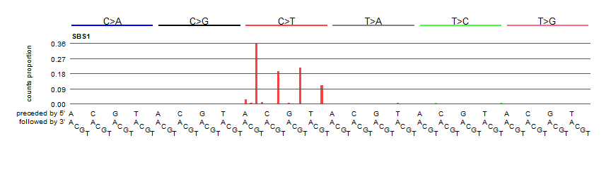
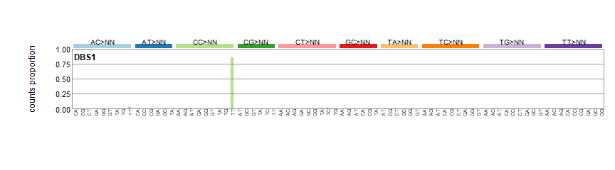

Introduction
------------

The [mSigAct web server](https://msigact.ai) provides methods for
analyzing mutational signatures. “mSigAct” is an abbreviation of
<big><strong>m</strong></big>utational
<big><strong>Sig</strong></big>nature
<big><strong>Act</strong></big>ivity. A mutational signature is the
pattern of mutations generated by a particular mutational process. (At
least, this is the ideal that we usually aim for.)

### Mutational signature examples

#### Mutations from CG to TG

These are “single base substitutions” (SBSs) caused by deamination of
5-methyl cytosine. We most often look at SBS mutations in the context of
preceding and following bases. We also, by convention, always look a
mutations from C or T (not G or A – we reverse complement if necessary).
In the figure above we see mutational signature “SBS1”, which is the
signature of 5-methyl cytosine deamination. It consists almost entirely
of mutations from ACG to ATG, CCG to CTG, GCG to GTG and TCG to TTG. We
call signatures based on SBS mutations in the context of the preceding
and following bases “SBS96” signatures. A compendium with standard
nomenclature is at the [COSMIC Single Base Substitution web
site](https://cancer.sanger.ac.uk/cosmic/signatures/SBS/index.tt).

We can also look a single base substitutions in the context of the
preceding and following 2 bases (giving us “SBS1536” signatures), and we
can also look at signatures of mutations in transcripts by
distinguishing their transcribed (antisense) and untranscrbed (sense)
strands (giving us “SBS192” signatures.)

#### Moderately-sized deletions with microhomology

These are common in tumors with defective homologous-recombination-based
DNA-damage repair, often BRCA1 or BRCA2-deficient tumors. The
classification for insertions and deletions is detailed at
<https://www.synapse.org/#!Synapse:syn11801742>

#### CC to TT mutations

These are a kind of of “doublet base substitution”, (DBS) mutations that
stem from ultraviolet-radiation-induced pyrimidine dimers. The
classification of DBSs is detailed at
<https://www.synapse.org/#!Synapse:syn11801895>

### A mutational spectrum is usually an overlay of multple mutational signatures

A single tumor or tissue sample usually contains mutations generated by
multiple mutational processes, each of which generates mutations that
when combined constitute the mutational spectrum of the sample, as show
in this figure:

(Reproduced from [Alexandrov et al.,
2020](https://www.nature.com/articles/s41586-020-1943-3), under the
[Creative Commons Attribution 4.0 International
License](https://creativecommons.org/licenses/by/4.0/))

This breast cancer has an SBS96 spectrum generated by an overlay of
signatures SBS1, SBS2, SBS3, SBS5, and SBS13, with SBS3 (the SBS
signature of defective homologous-recombination-based DNA repair)
contributing the the bulk of the mutations. The breast cancer’s DBS
spectrum has signatures DBS2, DBS4, DBS6, and DBS9. Its ID signature has
ID1, ID6, and ID8. The latter two indel signatures are characteristic of
tumors with defective homologous-recombination-based DNA repair, which
is consistent with the large number of mutations due to SBS3.

For more extensive background, please see [Alexandrov et al.,
2020](https://www.nature.com/articles/s41586-020-1943-3).

The a list and plots of the the currently known mutational signatures,
please see
\[<a href="https://cancer.sanger.ac.uk/cosmic/signatures/index.tt" class="uri">https://cancer.sanger.ac.uk/cosmic/signatures/index.tt</a>\]<a href="https://cancer.sanger.ac.uk/cosmic/signatures/index.tt" class="uri">https://cancer.sanger.ac.uk/cosmic/signatures/index.tt</a>.

Using the [mSigAct web server](https://msigact.ai) to create mutational spectrum catalogs from variant call files and plot them
-------------------------------------------------------------------------------------------------------------------------------

Please see the “Generate spectrum catalogs from VCFs” tab for more
information and examples. The [mSigAct web server](https://msigact.ai)
can generate and plot mutational spectra from VCF files generated by the
Strelka or Mutect variant callers.

Using the [mSigAct web server](https://msigact.ai) to estimate mutational signature activities
----------------------------------------------------------------------------------------------

individual mutational spectra. By “mutational signature activities” we
refer to the numbers of mutations generated by each mutational signature
(or more precisely, generated by each mutational process). For the
breast cancer example above, this would involve which mutational
signatures (processes) generated the somatic mutations and how many
mutations each signature generated. This is in fact a challenging
problem, and the purpose of this functionality in the [mSigAct web
server](https://msigact.ai) is to allow you to consider and examine all
the evidence in this analysis. Please see the “Upload spectra” tab for
more information and examples.

[mSigAct web server](https://msigact.ai) testing
------------------------------------------------

The [mSigAct web server](https://msigact.ai) has been tested under the
following browsers and operating systems

<table>
<thead>
<tr class="header">
<th style="text-align: center;">OS</th>
<th style="text-align: center;">Version</th>
<th style="text-align: center;">Chrome</th>
<th style="text-align: center;">Edge</th>
<th style="text-align: center;">Firefox</th>
<th style="text-align: center;">Safari</th>
</tr>
</thead>
<tbody>
<tr class="odd">
<td style="text-align: center;">Linux</td>
<td style="text-align: center;"></td>
<td style="text-align: center;">need</td>
<td style="text-align: center;"></td>
<td style="text-align: center;"></td>
<td style="text-align: center;"></td>
</tr>
<tr class="even">
<td style="text-align: center;">MacOS</td>
<td style="text-align: center;"></td>
<td style="text-align: center;">need</td>
<td style="text-align: center;">need</td>
<td style="text-align: center;"></td>
<td style="text-align: center;">Need</td>
</tr>
<tr class="odd">
<td style="text-align: center;">Windows</td>
<td style="text-align: center;">10</td>
<td style="text-align: center;">87.0.4280.88</td>
<td style="text-align: center;">87.0.664.60</td>
<td style="text-align: center;">83.0</td>
<td style="text-align: center;"></td>
</tr>
</tbody>
</table>

Code availability
-----------------

The [mSigAct web server](https://msigact.ai) code is available at github
at <https://github.com/steverozen/mSigAct.server> and is released under
the GPL3 open source license. Other code used by the web server includes
[mSigAct](https://github.com/steverozen/mSigAct),
[ICAMS](https://cran.r-project.org/package=ICAMS),
[ICAMSxtra](https://github.com/steverozen/ICAMSxtra), and
[PCAWG7](https://github.com/steverozen/PCAWG7), all released under the
GPL3 open source license.
